# YOLO-Image-Object-Detection-through-Deep-Learning
It's a Computer Vision project, where objects are detected from image, video and also in live(webcam or camera) using bounding boxes with respective object label class.  

➢	The processing of images representing natural scenes requires substantial elaboration at all levels: pre-processing, segmentation, recognition, and interpretation. These steps unmistakably influence the resulting quality of a vision system, so it must be endowed with some capabilities. We present here the vision problem in terms of internal organization and information management. The object is represented on a scale of categories and the task of the recognition algorithms is to find the most detailed category according to information extracted from the image. All tasks operate on one level. On this principle, we propose a model for the internal representation of a vision system, which tries to generalize the recognition of objects using categorization and cooperation.

➢	The main idea behind image object detection is to recognize the object on the ground with help of a high-resolution camera. The tools like Nvidia CUDA, OpenCV v4, and YOLOv4 are used for training the data set. The high-end deep learning algorithms of Darknet will be used to classify the data. The images are captured through a high-resolution camera and the detection of objects is done by deep learning algorithms. The techniques like bounding boxes are used to magnify the object from the entire screen. The accuracy of the object is also calculated using deep learning algorithms. The technique is used in war fields, agricultural fields, and other security purposes.

➢	The approach involves a single neural network trained end to end that takes a photograph as input and predicts bounding boxes and class labels for each bounding box directly. The technique offers lower predictive accuracy (e.g. more localization errors), although operates at 45 frames per second and up to 155 frames per second for a speed-optimized version of the model.

➢	The model works by first splitting the input image into a grid of cells, where each cell is responsible for predicting a bounding box if the center of a bounding box falls within the cell. Each grid cell predicts a bounding box involving the x, y coordinate, and the width and height, and the confidence. A class prediction is also based on each cell. The class probabilities map and the bounding boxes with confidences are then combined into a final set of bounding boxes and class labels. The image taken from the paper below summarizes the two outputs of the model

	Scaled YOLO v4 is a series of neural networks built on top of the improved and caled YOLOv4 network. Our neural network was trained from scratch without using pre-trained weights (Imagenet or any other).

	Scaled YOLOv4 utilizes massively parallel devices such as GPUs much more efficiently than EfficientDet.

	Improvements in Scaled YOLOv4 over YOLOv4:

    	Scaled YOLOv4 used optimal network scaling techniques to get YOLOv4-CSP -> P5 -> P6 -> P7 networks.

    	Improved network architecture: Backbone is optimized and Neck (PAN) uses Cross-stage-partial (CSP) connections and Mish    activation.

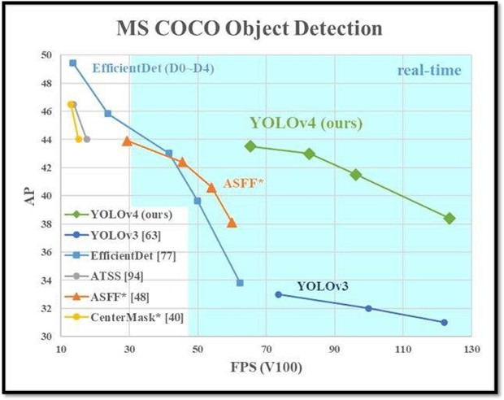

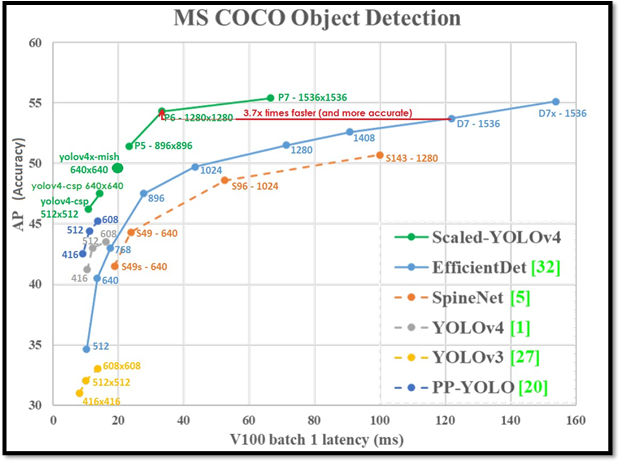

Precision & recall

Precision measures how accurate are your predictions. i.e. the percentage of your predictions are correct. Recall measures how well you find all the positives. For example, we can find 80% of the possible positive cases in our top K predictions.
IoU measures the overlap between 2 boundaries. We use that to measure how much our predicted boundary overlaps with the ground truth (the real object boundary). In some datasets, we predefine an IoU threshold (say 0.5) in classifying whether the prediction is a true positive or a false positive.

Mish, a novel self-regularized non-monotonic activation function which can be mathematically defined as:
 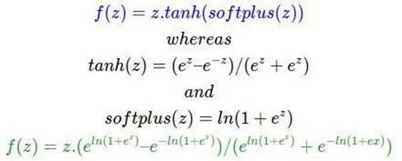

As activation functions play a crucial role in the performance and training dynamics in neural networks, we validated experimentally on several well-known benchmarks against the best combinations of architectures and activation functions. We also observe that data augmentation techniques have a favorable effect on benchmarks like ImageNet-1k and MS-COCO across multiple architectures. For example, Mish outperformed Leaky ReLU on YOLOv4 with a CSP-DarkNet-53 backbone on average precision (APval50) by 2.1% in MS- COCO object detection and ReLU on ResNet-50 on ImageNet-1k in Top-1 accuracy by ≈1% while keeping all other network parameters and hyperparameters constant. Furthermore, we explore the mathematical formulation of Mish about the Swish family of functions and propose an intuitive understanding of how the first derivative behavior may be acting as a regularize helping the optimization of deep neural networks. Code is publicly available.

**Bounding Box** with dimension priors and location prediction. We predict the height and width the box of the box offsets and cluster centroids. We predict the center coordinates relative to the location of the filter application using the sigmoid function. This figure blatantly self-plagiarised
 
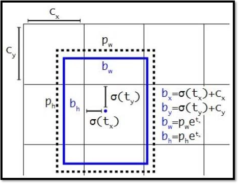

**_Running Object Detection on images and videos with DARKNET:_**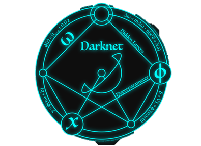

**_with YOLOv4:_**

_Before detection images:_
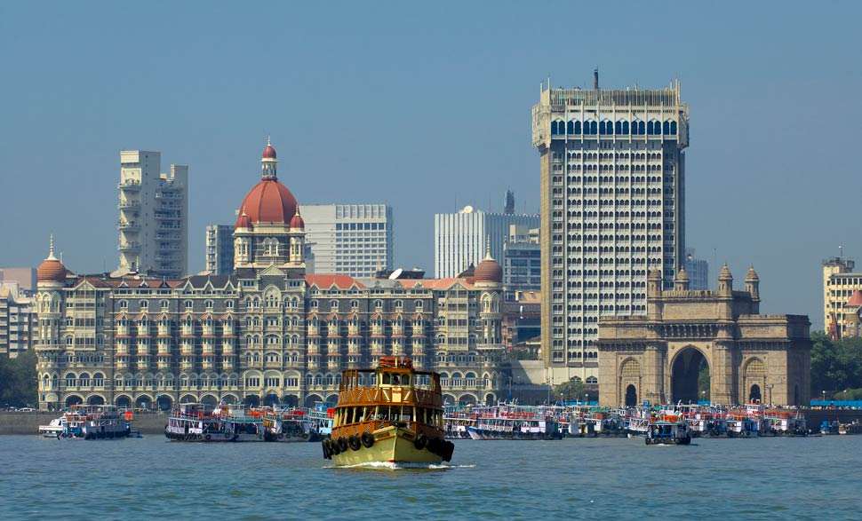

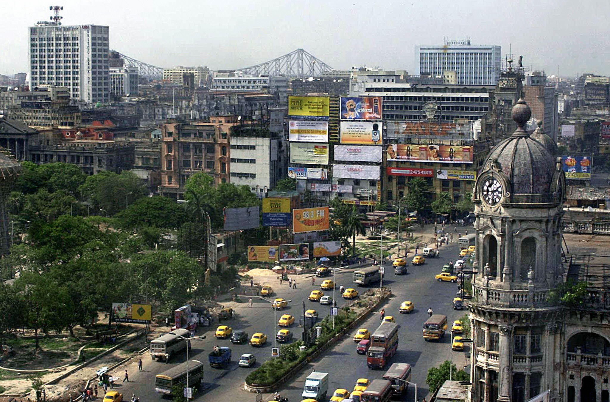

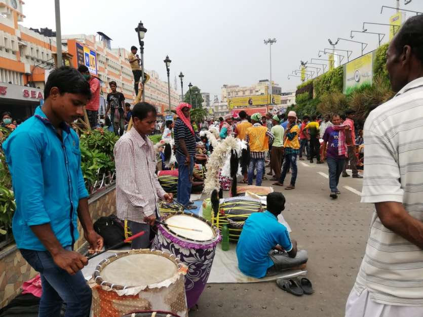
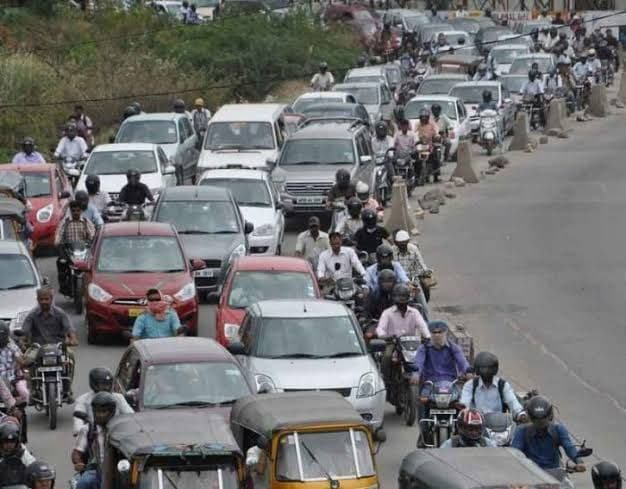
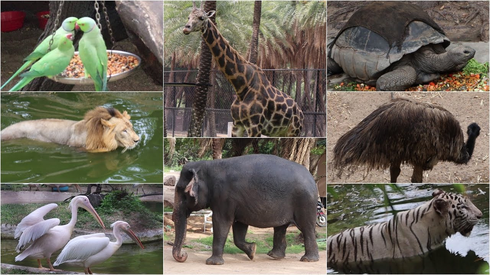

**_After Running YOLOv4 Object Detection on above images:_**

Executing the following command:

`darknet.exe detect cfg/yolov4.cfg yolov4.weights data/(image_name).jpg`

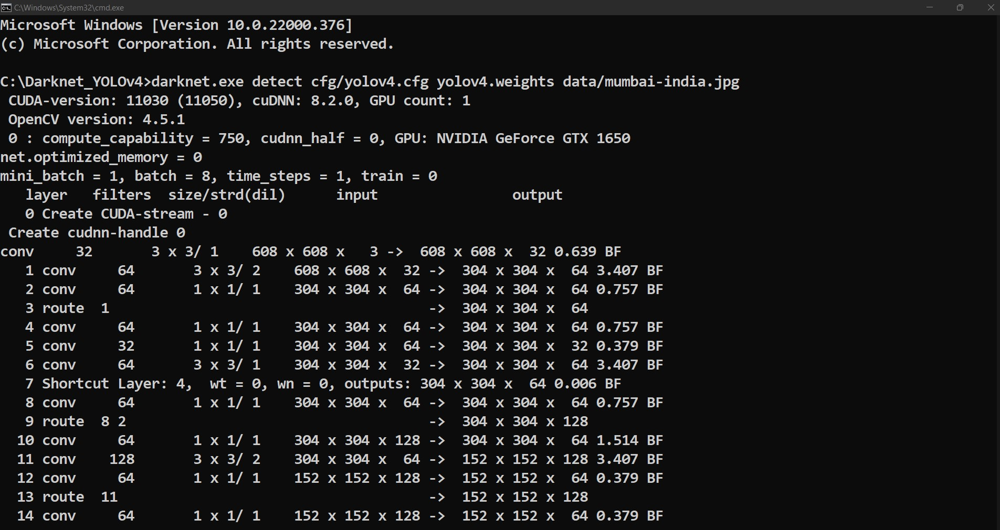
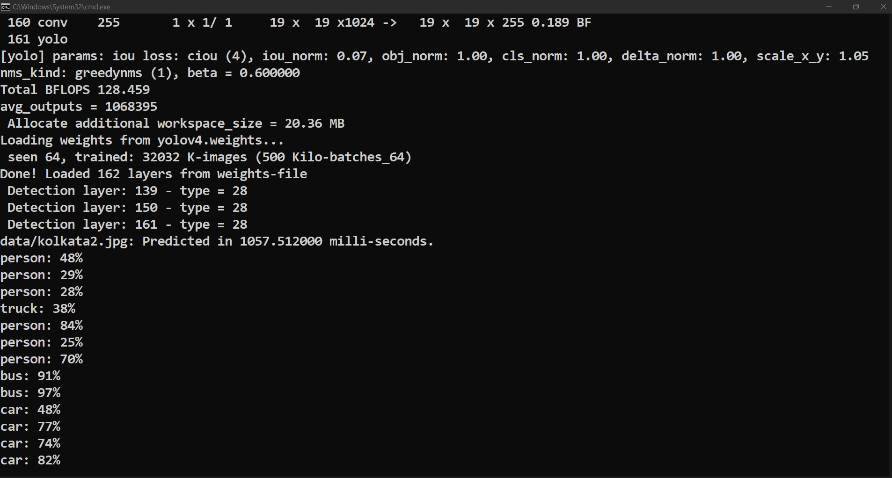

**_The objects detected through those images are:_**

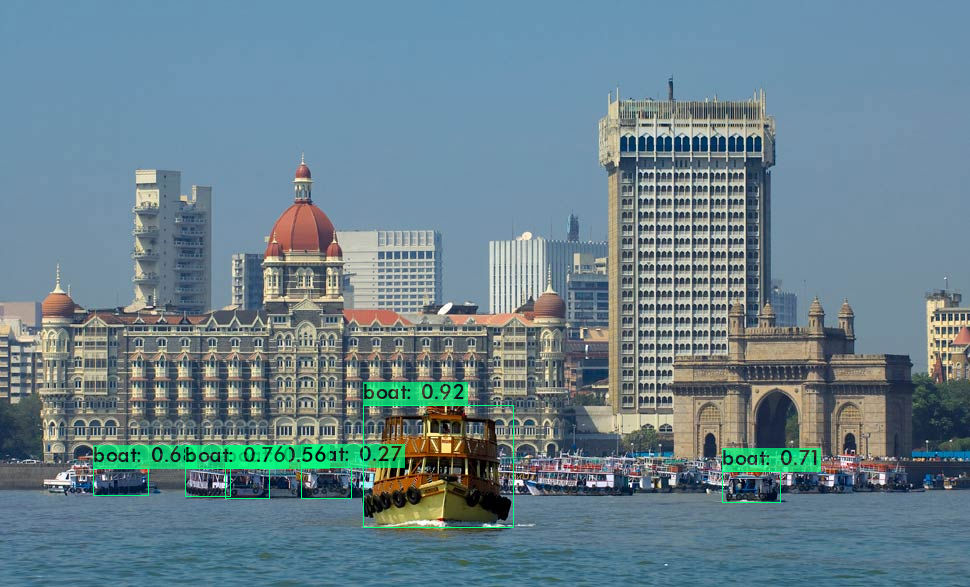
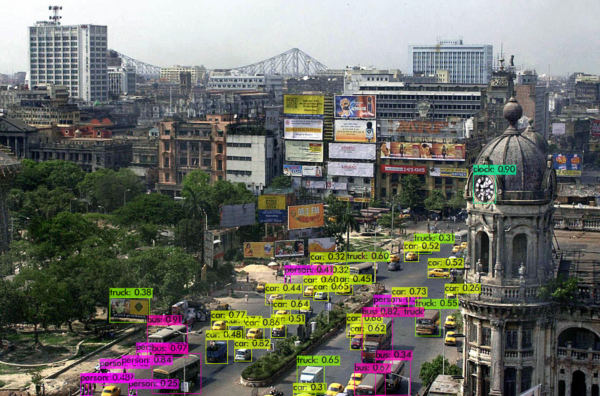
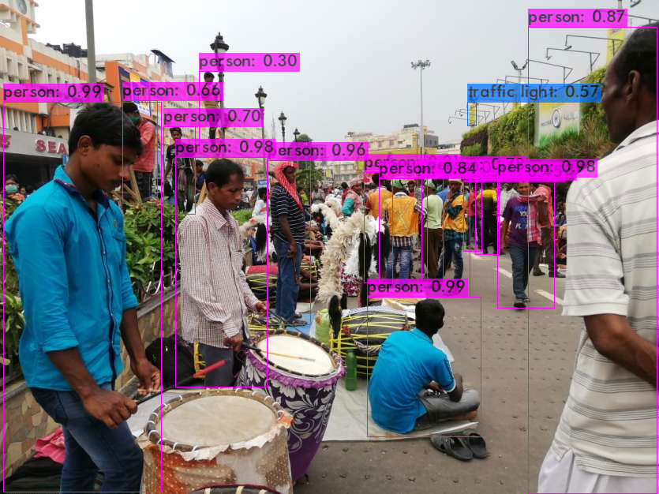
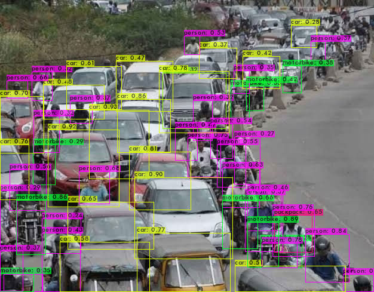
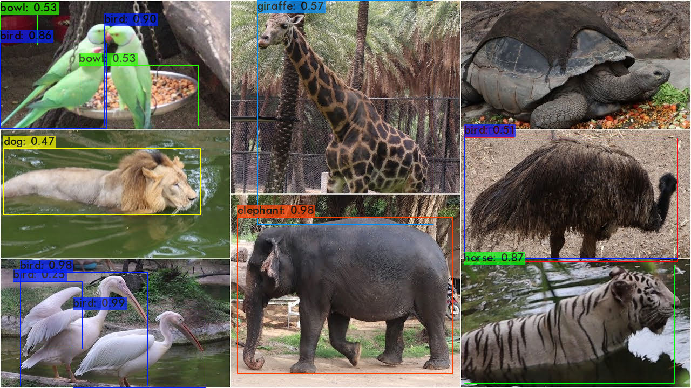
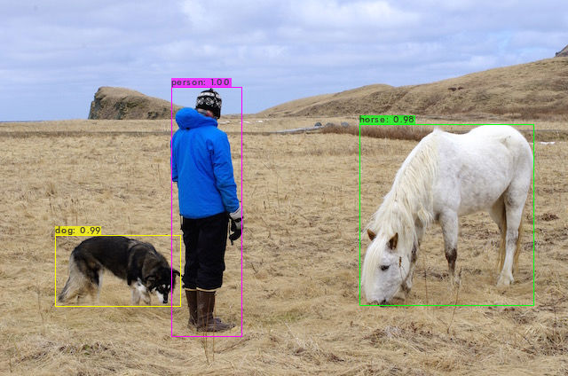

**_Similarly, Object Detection with videos is done, a sample one before detection_**

_Execute the command:_
