# YOLO-Image-Object-Detection-through-Deep-Learning
It's a Computer Vision project, where objects are detected from image, video and also in live(webcam or camera) using bounding boxes with respective object label class.  

➢	The processing of images representing natural scenes requires substantial elaboration at all levels: pre-processing, segmentation, recognition, and interpretation. These steps unmistakably influence the resulting quality of a vision system, so it must be endowed with some capabilities. We present here the vision problem in terms of internal organization and information management. The object is represented on a scale of categories and the task of the recognition algorithms is to find the most detailed category according to information extracted from the image. All tasks operate on one level. On this principle, we propose a model for the internal representation of a vision system, which tries to generalize the recognition of objects using categorization and cooperation.

➢	The main idea behind image object detection is to recognize the object on the ground with help of a high-resolution camera. The tools like Nvidia CUDA, OpenCV v4, and YOLOv4 are used for training the data set. The high-end deep learning algorithms of Darknet will be used to classify the data. The images are captured through a high-resolution camera and the detection of objects is done by deep learning algorithms. The techniques like bounding boxes are used to magnify the object from the entire screen. The accuracy of the object is also calculated using deep learning algorithms. The technique is used in war fields, agricultural fields, and other security purposes.

➢	The approach involves a single neural network trained end to end that takes a photograph as input and predicts bounding boxes and class labels for each bounding box directly. The technique offers lower predictive accuracy (e.g. more localization errors), although operates at 45 frames per second and up to 155 frames per second for a speed-optimized version of the model.

➢	The model works by first splitting the input image into a grid of cells, where each cell is responsible for predicting a bounding box if the center of a bounding box falls within the cell. Each grid cell predicts a bounding box involving the x, y coordinate, and the width and height, and the confidence. A class prediction is also based on each cell. The class probabilities map and the bounding boxes with confidences are then combined into a final set of bounding boxes and class labels. The image taken from the paper below summarizes the two outputs of the model

	Scaled YOLO v4 is a series of neural networks built on top of the improved and caled YOLOv4 network. Our neural network was trained from scratch without using pre-trained weights (Imagenet or any other).

	Scaled YOLOv4 utilizes massively parallel devices such as GPUs much more efficiently than EfficientDet.

	Improvements in Scaled YOLOv4 over YOLOv4:

    	Scaled YOLOv4 used optimal network scaling techniques to get YOLOv4-CSP -> P5 -> P6 -> P7 networks.

    	Improved network architecture: Backbone is optimized and Neck (PAN) uses Cross-stage-partial (CSP) connections and Mish    activation.

Precision & recall

Precision measures how accurate are your predictions. i.e. the percentage of your predictions are correct. Recall measures how well you find all the positives. For example, we can find 80% of the possible positive cases in our top K predictions.
IoU measures the overlap between 2 boundaries. We use that to measure how much our predicted boundary overlaps with the ground truth (the real object boundary). In some datasets, we predefine an IoU threshold (say 0.5) in classifying whether the prediction is a true positive or a false positive.

Mish, a novel self-regularized non-monotonic activation function which can be mathematically defined as:
 

As activation functions play a crucial role in the performance and training dynamics in neural networks, we validated experimentally on several well-known benchmarks against the best combinations of architectures and activation functions. We also observe that data augmentation techniques have a favorable effect on benchmarks like ImageNet-1k and MS-COCO across multiple architectures. For example, Mish outperformed Leaky ReLU on YOLOv4 with a CSP-DarkNet-53 backbone on average precision (APval50) by 2.1% in MS- COCO object detection and ReLU on ResNet-50 on ImageNet-1k in Top-1 accuracy by ≈1% while keeping all other network parameters and hyperparameters constant. Furthermore, we explore the mathematical formulation of Mish about the Swish family of functions and propose an intuitive understanding of how the first derivative behavior may be acting as a regularize helping the optimization of deep neural networks. Code is publicly available.

**Bounding Box** with dimension priors and location prediction. We predict the height and width the box of the box offsets and cluster centroids. We predict the center coordinates relative to the location of the filter application using the sigmoid function. This figure blatantly self-plagiarised
 

## <ins>**_Running Object Detection on images and videos with DARKNET:_**</ins>

<ins>**_with YOLOv4:_**</ins>

_Before detection images:_

**_After Running YOLOv4 Object Detection on above images:_**

Executing the following command:

`darknet.exe detect cfg/yolov4.cfg yolov4.weights data/(image_name).jpg`

**_The objects detected through those images are:_**

_Similarly, **Object Detection with videos** is done but this time with **Scaled YOLOv4's CSP**(Cross Stage Partial), a sample one(randomly chosen from youtube) video before detection:_

**_Please Note:_** Before Running the Object Detection environment on this video, please download the csp weights and configuration files from the given links at the end of this readme and store the **.cfg file** into **cfg folder** while the **.weights file** will be place in the main directory

_Execute the command:_

`darknet.exe detector demo cfg/coco.data cfg/yolov4-csp.cfg yolov4-csp.weights -ext_output test/(video_name).mp4 -out_filename results.mp4`

_With this command our object detected video is saved in the main directory as 'results.mp4'(you can name anything to the file in command to save file in your chosen name format)_

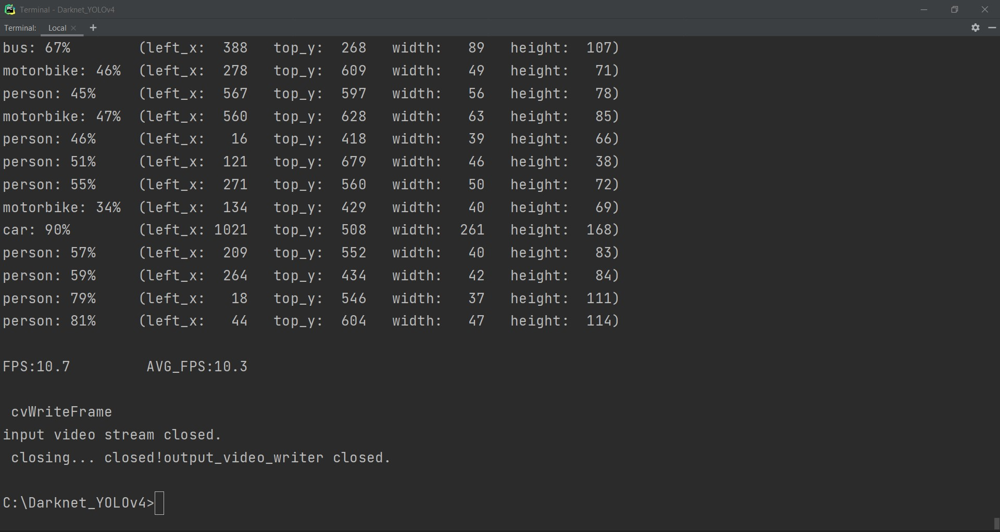

**_The Object Detected Video after inference with Scaled YOLOv4's CSP can seen below:_**

_Here, **MS-COCO**(**M**icro**S**oft **C**ommon **O**bjects in **CO**ntext) [dataset](Darknet_YOLOv4/data/coco.names) having 80 different object labels_. If you want to have your own custom dataset with object labels that you want detect the objects from image and video(from source or live),then we should **_train with custom dataset for obtaining custom weights_**, which can be used for inference.

For that command used is
`python generate_train.py`
`darknet.exe detector train data/obj.data cfg/yolov4-p5_custom.cfg darknet53.conv.74`

For instance, we just took some dataset [images](https://storage.googleapis.com/openimages/web/index.html) and trained images with **plant** and **tree** labels, obtained weights, ran inference 

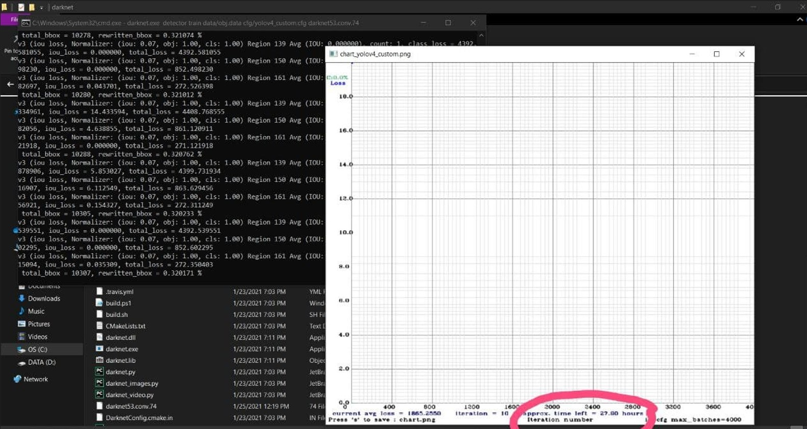
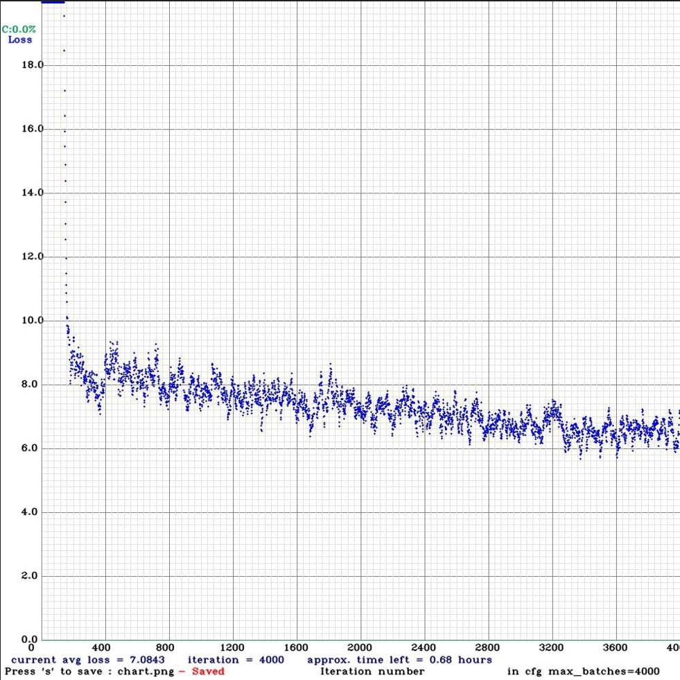
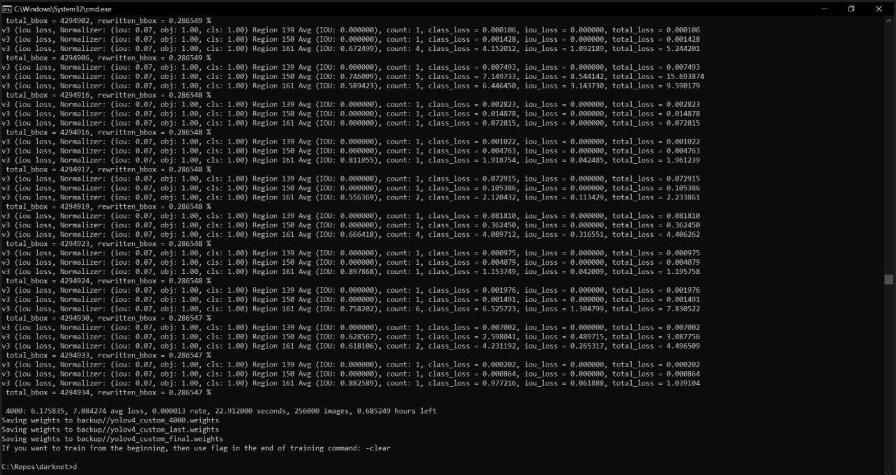
Successfully, my custom object detection worked perfectly as we can see it detected plant and tree objects from my apartment balcony view consisting some flower pots and plants(live detection).
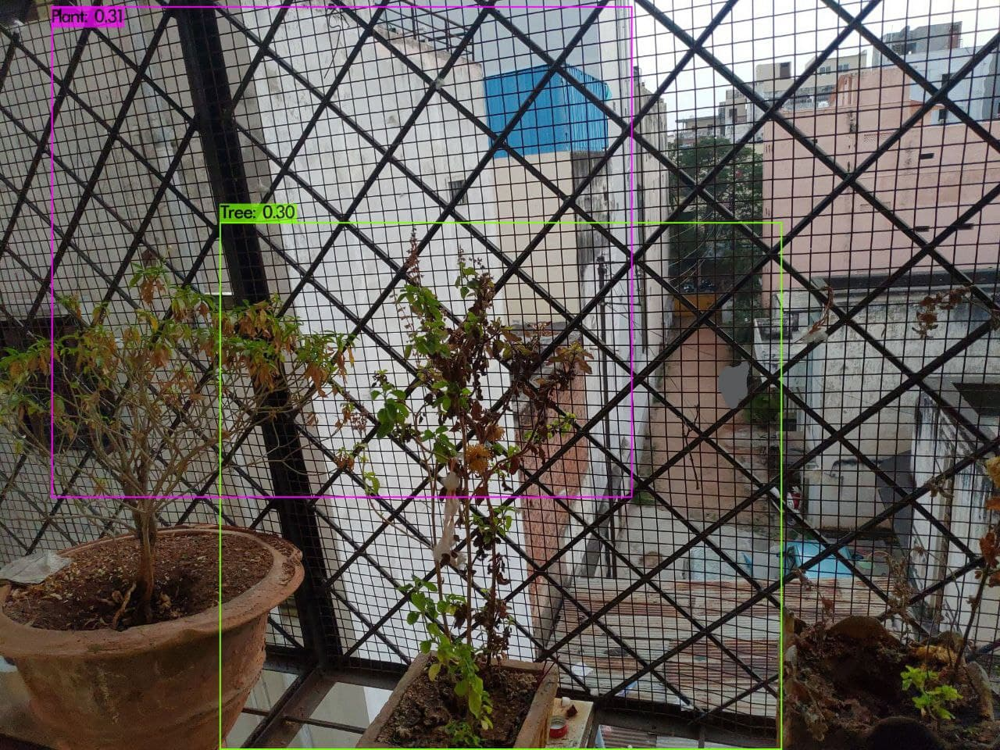

<ins>For training images, we can also use **_Microsoft Azure's Cognitive Services [Custom Vision](https://www.customvision.ai)_**</ins>

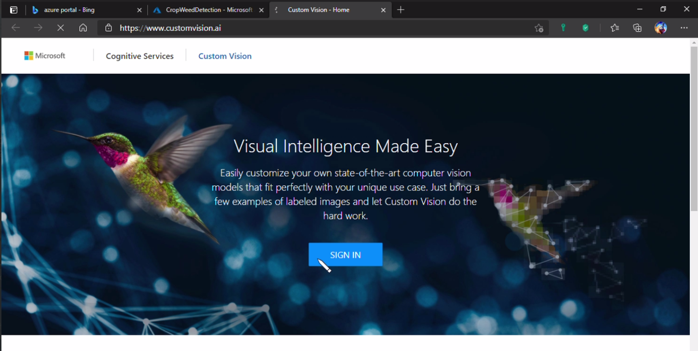

For this project instance, we have done labeling with crop and weed as labels for sample dataset of Crop and Weed Classification project in **Azure** **_to generate custom trained model_**:
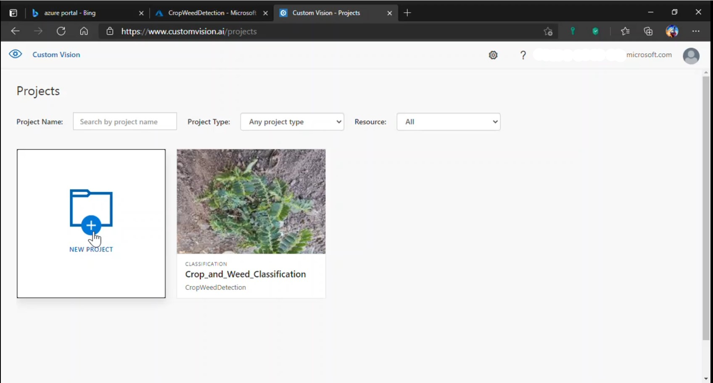
.gif)
.gif)
.gif)
.gif)
.gif)
After Advance Training(Remember to select '**General(Compact) domain**') with more Iterations, we get the trained weights model:
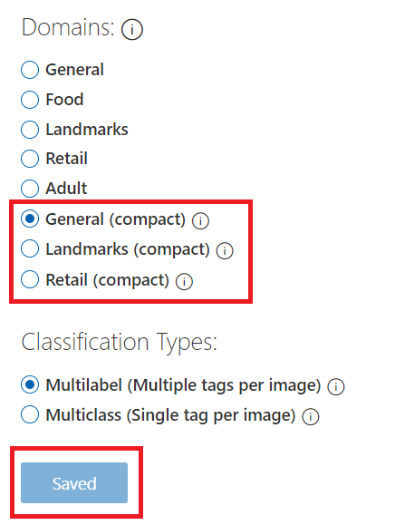

This trained weights can be saved as a **TensorFlow Model** with **Export** option:
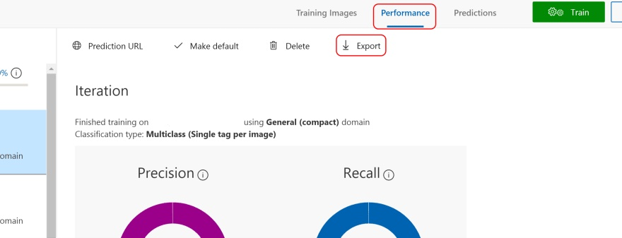
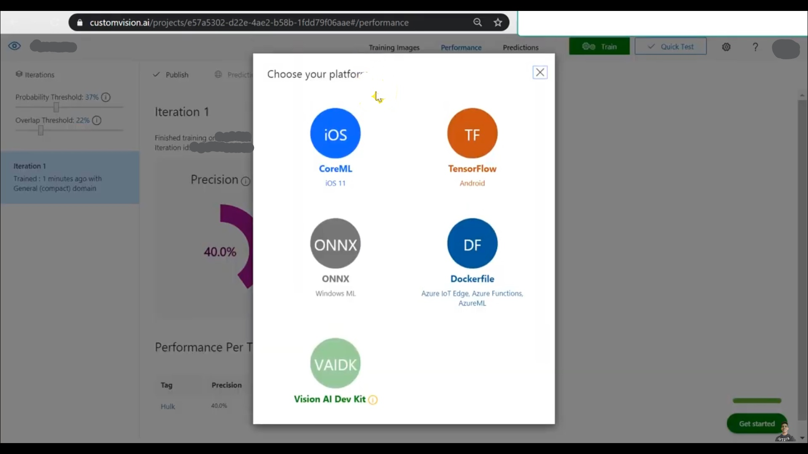

_Now, we can use those custom object labels weights '**.tf**' models locally into your project._

## <ins>**_Object Detection on images and videos with TENSORFLOW:_**</ins>

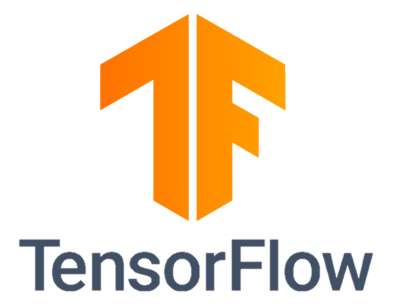

Before we use those custom trained weights in 'tf' model, you should setup a TensorFlow environment, to do that please install the [file](TensorFlow_YOLOv4/conda-gpu.yml) with the command:

`conda env create -f conda-gpu.yml`

in Anaconda prompt or command prompt and activate it:

`conda activate TensorFlow2_YOLOv4_GPU`

_To implement **YOLOv4 or Scaled YOLOv4** using TensorFlow, initially we must convert the **.weights** into the corresponding **TensorFlow model** files and then run the model._

**_Convert darknet weights to tensorflow_**

**YOLOv4**
`python save_model.py --weights ./data/yolov4.weights --output ./checkpoints/yolov4-416 --input_size 416 --model yolov4`

**YOLOv4-tiny**
`python save_model.py --weights ./data/yolov4-tiny.weights --output ./checkpoints/yolov4-tiny-416 --input_size 416 --model yolov4 --tiny`

**custom yolov4**
`python save_model.py --weights ./data/custom.weights --output ./checkpoints/custom-416 --input_size 416 --model yolov4` 

For running inference on different images and videos, you should execute the following commands:

_For Images:_
`python detect.py --weights ./checkpoints/yolov4-416 --size 416 --model yolov4 --images ./data/images/(image-name).jpg`

_Run yolov4-tiny tensorflow model_
`python detect.py --weights ./checkpoints/yolov4-tiny-416 --size 416 --model yolov4 --images ./data/images/(image_name).jpg --tiny`

_Run custom yolov4 tensorflow model_
`python detect.py --weights ./checkpoints/custom-416 --size 416 --model yolov4 --images ./data/images/(image_name).jpg`

Now, you can also use the above Azure's CV generated TensorFlow model here.

_For Videos:_

_Run yolov4 on video_
`python detect_video.py --weights ./checkpoints/yolov4-416 --size 416 --model yolov4 --video ./data/video/(video_name).mp4 --output ./detections/results.mp4`

_Run custom yolov4 model on video_
`python detect_video.py --weights ./checkpoints/custom-416 --size 416 --model yolov4 --video ./data/video/(video_name).mp4 --output ./detections/results.mp4`

_Run yolov4 on webcam_
`python detect_video.py --weights ./checkpoints/yolov4-416 --size 416 --model yolov4 --video 0 --output ./detections/results.mp4`

#### _**The detection be like similar to the Darknet Detection**_ (Inference ran on random youtube video):

and for image:

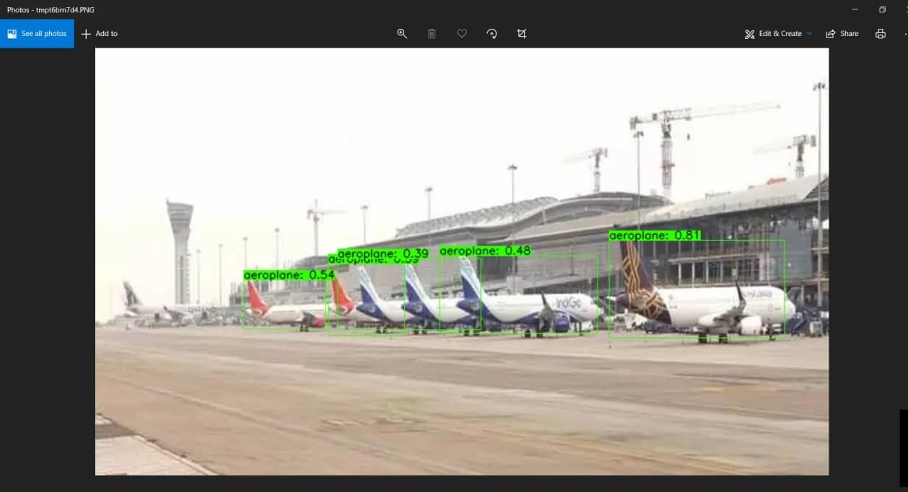

## <ins>_**Object Detection on images and videos with PYTORCH:**_</ins>

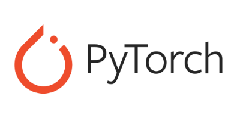

_Initially to implement **YOLOv4 or Scaled YOLOv4** with PyTorch, we have setup an environment for YOLOv4 with PyTorch in **Anaconda** Prompt or Navigator  for efficient module run:_

We can do this by following commands and running **requirements.txt** file:

_**pip/conda install required packages**_

`conda install seaborn thop`

_**install mish-cuda if you want to use mish activation**_ using links 
https://github.com/thomasbrandon/mish-cuda

https://github.com/JunnYu/mish-cuda 

`cd /`

`git clone https://github.com/JunnYu/mish-cuda`

`cd mish-cuda`

`python setup.py build install`

but don't worry, there's already generated Mish-Cuda folder which is included in repo above.

`conda install -r requirements.txt`

* _**Now for given generating the YOLOv4 and Scaled YOLOv4(csp, p5, p6, p7) weights in PyTorch models by training with configurations located in config folder, run command:**_
`python train.py --device 0 --batch-size 16 --img 640 640 --data coco.yaml --cfg cfg/yolov4-p7.yaml --weights '' --name yolov4-p7`
where the **.pt** files will be generated in **weights** folder

* **_To run the test, inference on the live webcam for testing the generated Scaled YOLOv4 weights above, the command given:_**
  
   `python detect.py --source 0`

### **_Object Detection with PyTorch using Scaled YOLOv4:_**
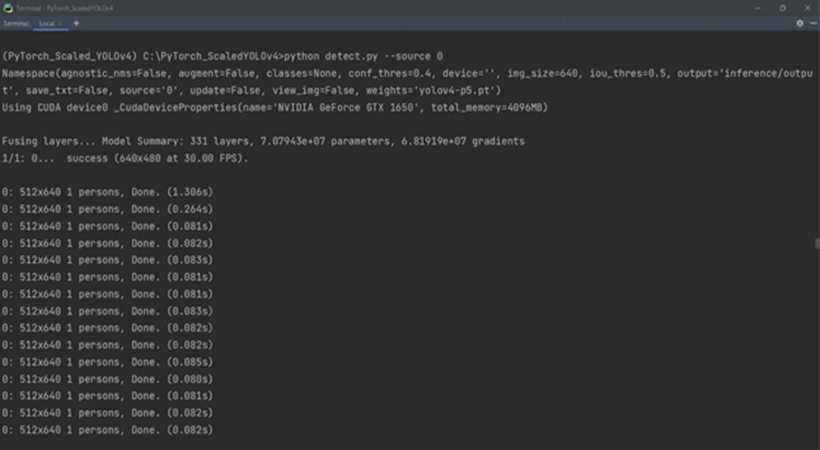
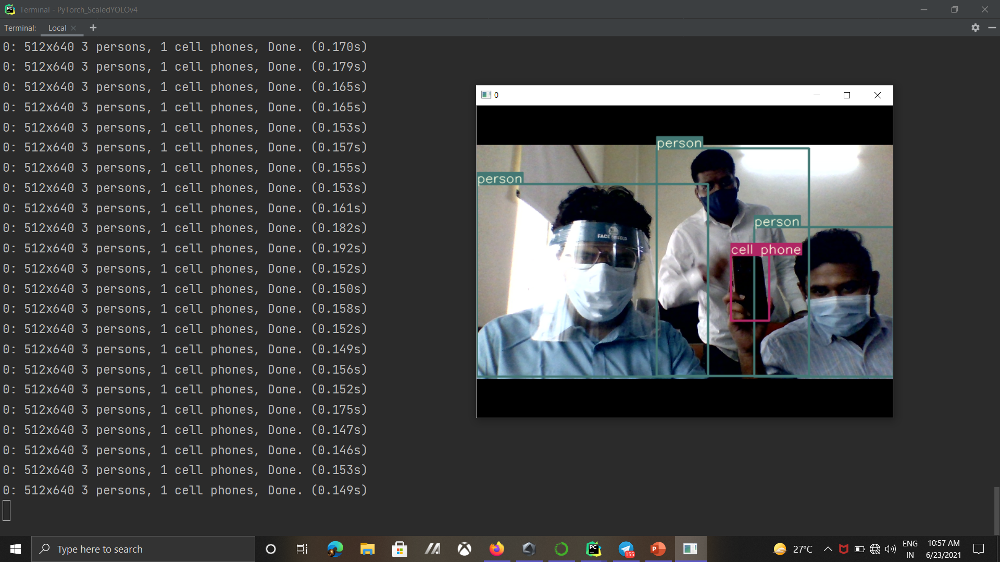
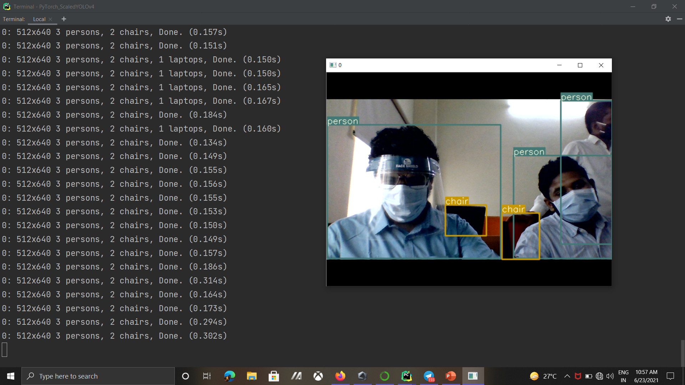

### Acknowledgements

  
References

  1. Scaled YOLOv4 research paper - https://arxiv.org/abs/2011.08036
  2. YOLO v4 research paper - https://arxiv.org/abs/2004.10934
  3. Darknet installation - https://pjreddie.com/darknet/install/
  4. TensorFlow Object Detection Module - https://github.com/theAIGuysCode/tensorflow-yolov4-tflite
  5. PyTorch inference - 
      * https://github.com/WongKinYiu/PyTorch_YOLOv4
      * https://github.com/WongKinYiu/ScaledYOLOv4
  6. Open Images Dataset v6 for a custom dataset with boxes - https://storage.googleapis.com/openimages/web/visualizer/index.html?set=train &type=detection&c=%2Fm%2F015wgc
  7. Microsoft Azure Cognitive Services for training datasets and download the weights file - https://www.customvision.ai/
  

